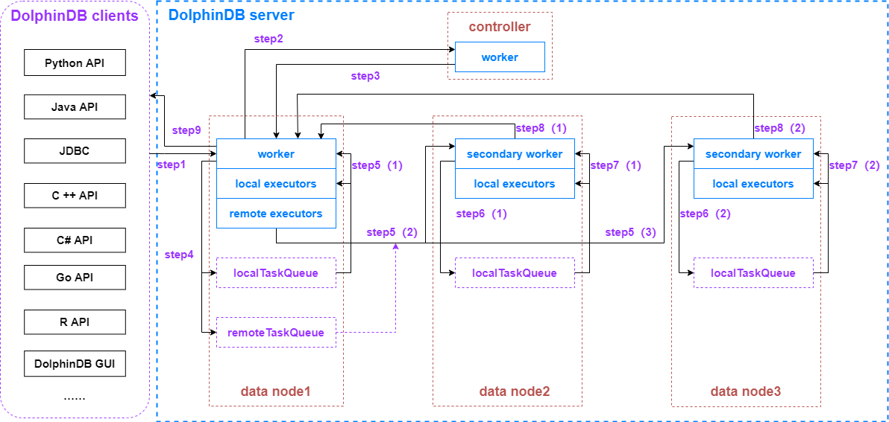

# 从一次 SQL 查询的全过程看 DolphinDB 的线程模型

分布式系统较为复杂，无论写入还是查询，都需要多个节点的配合才能完成操作。本教程以一个分布式 SQL 查询为例，介绍 DolphinDB 分布式数据库的数据流以及其中经历的各类线程池。通过了解 SQL 查询的全过程，也可以帮助我们更好地优化 DolpinDB 的配置和性能。

## 1. DolphinDB 线程类型

* **woker**

  常规交互作业的工作线程，用于接收客户端请求，将任务分解为多个小任务，根据任务的粒度自己执行或者发送给 local executor 或 remote executor 执行。

* **local executor**

  本地执行线程，用于执行 worker 分配的子任务。每个本地执行线程一次只能处理一个任务。所有工作线程共享本地执行线程。[`ploop`](https://www.dolphindb.cn/cn/help/200/Functionalprogramming/TemplateFunctions/loopPloop.html)、[`peach`](https://www.dolphindb.cn/cn/help/200/Functionalprogramming/TemplateFunctions/each.html) 等并行计算函数的计算任务分配在本地执行线程完成。

* **remote executor**

  远程执行线程，将远程子任务发送到远程节点的独立线程。

* **batch job worker**

  使用 [`submitJob`](https://www.dolphindb.cn/cn/help/FunctionsandCommands/FunctionReferences/s/submitJob.html) 或 [`submitJobEx`](https://www.dolphindb.cn/cn/help/FunctionsandCommands/FunctionReferences/s/submitJobEx.html) 创建批处理作业的工作线程。该线程在任务执行完后若闲置 60 秒则会被系统自动回收，不再占用系统资源。

* **web worker**

  处理 HTTP 请求的工作线程。DolphinDB 提供了基于 web 的集群管理界面，用户可以通过 web 与 DolphinDB 节点进行交互，提交的请求由该线程处理。

* **secondary worker**

  次级工作线程。当前节点产生的远程子任务，会在远程节点的次级工作线程上执行，用于避免作业环，解决节点间的任务循环依赖而导致的死锁问题。

* **dynamic worker**

  动态工作线程。当所有的工作线程被占满且有新任务时，系统会自动创建动态工作线程来执行任务。根据系统并发任务的繁忙程度，总共可以创建三个级别的动态工作线程，每一个级别可以创建 maxDymicWorker 个动态工作线程。该线程在任务执行完后若闲置 60 秒则会被系统自动回收，不再占用系统资源。

* **infra worker**

  基础设施处理线程。当开启元数据高可用或流数据高可用的时候，系统会自动创建基础设施处理线程，用于处理集群节点间的 raft 信息同步工作。

* **urgent worker**

  紧急工作线程，只接收一些特殊的系统级任务，如登录 [`login`](https://www.dolphindb.cn/cn/help/200/FunctionsandCommands/CommandsReferences/l/login.html) ，取消作业 [`cancelJob`](https://www.dolphindb.cn/cn/help/FunctionsandCommands/CommandsReferences/c/cancelJob.html)、[`cancelConsoleJob`](https://www.dolphindb.cn/cn/help/FunctionsandCommands/CommandsReferences/c/cancelConsoleJob.html) 等。

* **diskIO worker**

  磁盘数据读写线程，通过参数 diskIOConcurrencyLevel 控制。如果 diskIOConcurrencyLevel = 0，表示直接用当前线程来读写磁盘数据。如果 diskIOConcurrencyLevel > 0，则会创建相应个数的指定线程来读写磁盘数据。

## 2. 不同类型线程与配置参数的关系

| 线程类型         | 配置参数               | 默认配置                |
| ---------------- | ---------------------- | ----------------------- |
| woker            | wokerNum               | 默认值是 CPU 的内核数   |
| local executor   | localExecutors         | 默认值是 CPU 内核数减1  |
| remote executor  | remoteExecutors        | 默认值是1               |
| batch job worker | maxBatchJobWorker      | 默认值是 workerNum 的值 |
| web worker       | webWorkerNum           | 默认值是1               |
| secondary worker | secondaryWorkerNum     | 默认值是 workerNum 的值 |
| dynamic worker   | maxDynamicWorker       | 默认值是 workerNum 的值 |
| infra worker     | infraWorkerNum         | 默认值是 2              |
| urgent worker    | urgentWorkerNum        | 默认值是 1              |
| diskIO worker    | diskIOConcurrencyLevel | 默认值是 1              |

## 3. API 发起一次 SQL 查询的线程经历

DolphinDB 的主要节点类型：

* **controller**

  控制节点，负责收集代理节点和数据节点的心跳，监控每个节点的工作状态，管理分布式文件系统的元数据和事务。

* **data node**

  数据节点，既可以存储数据，也可以完成查询和复杂的计算。

* **compute node**

  计算节点，只用于计算，应用于包括流计算、分布式关联、机器学习、数据分析等场景。计算节点不存储数据，故在该节点上不能建库建表，但可以通过 [`loadTable`](https://www.dolphindb.cn/cn/help/200/FunctionsandCommands/FunctionReferences/l/loadTable.html) 加载数据进行计算。可以通过在集群中配置计算节点，将写入任务提交到数据节点，将所有计算任务提交到计算节点，实现存储和计算的分离。2.00.1版本开始支持计算节点。

综上，API 发起的 SQL 查询可以提交到一个协调节点（coordinator） 来完成数据的查询和计算请求。 coordinator 可以是集群中的 data node 或者 compute node。当使用 2.00.1 及以上版本时，用户可以通过在集群中配置 compute node，将 SQL 查询任务全部提交到 compute node，实现存储和计算的分离。下面以 API 向 coordinator 发起一次 SQL 查询为例，讲述整个过程中所调度的所有线程。



**step1：DolphinDB 客户端向 coordinator 发起数据查询请求**

以 coordinator 为 data node 为例，例如发起一次聚合查询，查询语句如下：

```sql
select avg(price) from loadTable("dfs://database", "table") where year=2021 group by date
```

假设上述聚合查询语句总共涉及 300 个分区的数据，且正好平均分配在三个数据节点。

> data node1：100 chunks；data node2：100 chunks；data node3：100 chunks

DolphinDB 客户端将查询请求进行二进制序列化后通过 tcp 协议传输给 data node1。

**step2：data node1 收到查询请求**

data node1 收到客户端的查询请求后，将分配 1 个 worker 线程对内容进行反序列化和解析。当发现内容是 SQL 查询时，会向 controller 发起请求，获取跟这个查询相关的所有分区的信息。整个 SQL 查询未执行完毕时，当前的 worker 线程会被一直占用。

**step3：controller 收到 data node1 的请求**

controller 收到 data node1 的请求后，将分配 1 个 worker 线程对内容进行反序列化和解析，准备好本次 SQL 查询涉及的数据分区信息后，由该 worker 线程序列化后通过 tcp 协议传输给 data node1。controller 的 worker 完成该工作后将从队列中获取下一个请求。

> data node1：100 chunks；data node2：100 chunks；data node3：100 chunks

**step4：data node1 收到 controller 返回的信息**

data node1 收到 controller 返回的信息后，由一直占用的 worker 线程对内容进行反序列化和解析，得知本次 SQL 查询涉及的数据分区信息后，将位于本节点的分区数据计算任务发送到本地任务队列，此时本地任务队列会产生 100 个子任务。同时，将在远程节点 data node2、data node3 的分区数据计算任务以 group task 的方式发送到远程任务队列，所以远程任务队列会被添加2个远程任务，分别打上 data node2 和 data node3 的标志。

**step5（1）：本地 worker 和 local executor 消费本地任务队列**

此时，一直占用的 worker 线程和 local executor 线程会同时并行消费本地任务队列的子任务。所以配置项中的 wokerNum 和 localExecutors 很大程度上决定了系统的并发计算能力。

**step5（2）（3）：本地 remote executor 发送远程任务至远程节点**

同时，remote executor 线程将远程任务队列的内容序列化后通过 tcp 协议分别发送到 data node2 和 data node3。

**step6（1）（2）：远程节点收到远程任务**

data node2 和 data node3 收到远程任务后，将分配 1 个 secondary worker 线程对内容进行反序列化和解析，并将计算任务发送到本地任务队列，此时 data node2 和 data node3 的本地任务队列都会产生 100 个子任务。

**step7（1）（2）：远程节点 secondary worker 和 local executor 消费本地任务队列**

此时，data node2 和 data node3 上一直占用的 secondary worker 线程和 local executor 线程会同时并行消费本地任务队列的子任务。所以配置项中的 secondaryWorkerNum 对系统的并发计算能力也有一定影响。

**step8（1）（2）：远程节点返回中间计算结果至 data node1**

当 data node2 和 data node3 涉及的计算任务完成后，分别得到了本次 SQL 查询的中间计算结果，由一直占用的 secondary worker 线程对内容进行序列化后通过 tcp 协议传输给 data node1。

**step9：data node1 计算最终结果并返回给客户端**

data node1 接收到 data node2 和 data node3 返回的中间计算结果后，由一直占用的 worker 线程对内容进行反序列化，然后在该线程上计算出最终结果，并在序列化后通过 tcp 协议传输给客户端。

DolphinDB 客户端接收到 data node1 返回的信息后，经过反序列化显示本次 SQL 查询的结果。

**coordinator 为 data node 和 compute node 的区别**

* compute node 不存储数据，所以 compute node 解析客户端的 SQL 查询后，从 controller 拿到本次 SQL 查询涉及的数据分区信息，会将所有数据查询任务都分配到 data node 执行，得到每个 data node 返回的中间结果，最后调度 compute node 的本地资源计算最终结果并返回给客户端。
*  将所有 SQL 查询都提交到 compute node 后，可以实现存储和计算的分离，减轻 data node 的计算工作负担。当实时写入的数据量非常大时，建议配置 compute node，将所有 SQL 查询都提交到 compute node，实现存储和计算的分离。2.00.1版本开始支持计算节点。

## 4. SQL 查询过程分析

通过对 API 发起一次 SQL 查询的线程经历统计分析可以发现，本次 SQL 查询一共发生了 8 次 tcp 传输，其中 2 次是 DolphinDB server 和 DolphinDB client 之间的传输。如果查询结果的数据量比较大，但对查询结果的延时性又比较敏感，可以优化的方向主要有以下几个：

* 集群节点间为内网通信，推荐万兆以太网。
* DolphinDB server 和 DolphinDB client 间为内网通信。
* API 指定查询结果返回进行数据压缩。
* 线程配置参数优化。
* SQL 语句优化：where 条件添加分区字段的信息过滤，起到分区剪枝的目的，避免全表扫描，这样可以大大减少子任务的数目。
* 增加每个节点的磁盘卷的数量。这样更多的磁盘可以并行读取分区的数据。
* 增加license 限制的 CPU 核心数和内存大小，提升系统的并行或并发处理能力。

## 5. 线程配置参数优化

* **wokerNum**

  如果 license 限制的 CPU 核心数大于物理机 CPU 核心数，推荐 wokerNum 等于物理机 CPU 核心数；如果 license 限制的 CPU 核心数小于等于物理机 CPU 核心数，推荐 wokerNum 等于 license 限制的 CPU 核心数。

* **localExecutors**

  推荐 localExecutors = wokerNum - 1

* **remoteExecutors**

  推荐 remoteExecutors = n - 1，n 表示集群的节点数。如果是单节点 single 模式或者是单数据节点集群，不需要配置 remoteExecutors 的值。

* **maxBatchJobWorker**

  推荐 maxBatchJobWorker = wokerNum，采用默认值。

* **webWorkerNum**

  推荐控制节点 webWorkerNum 可以配置为 4，数据节点 webWorkerNum 可以配置为 1。因为正常情况下很少通过 web 与 DolphinDB 节点交互的方式提交查询任务。

* **secondaryWorkerNum**

  推荐 secondaryWorkerNum = wokerNum，采用默认值。

* **maxDynamicWorker**

  推荐 maxDynamicWorker = wokerNum，采用默认值。

* **infraWorkerNum**

  推荐 infraWorkerNum = 2，采用默认值。

* **urgentWorkerNum**

  推荐 urgentWorkerNum = 1，采用默认值。

* **diskIOConcurrencyLevel**

  对于 hdd 磁盘，推荐 diskIOConcurrencyLevel 等于对应节点下通过 volumes 参数配置的磁盘个数。对于 ssd 磁盘，推荐 diskIOConcurrencyLevel = 0。

