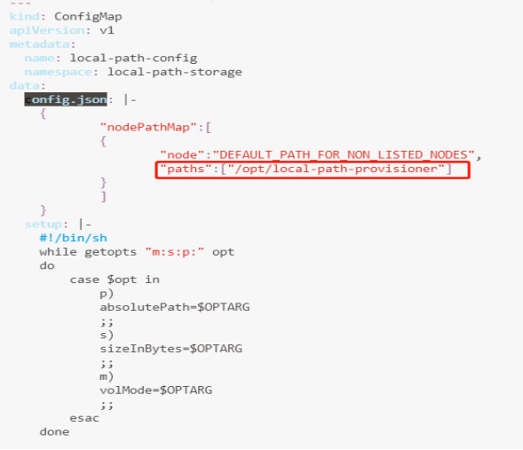
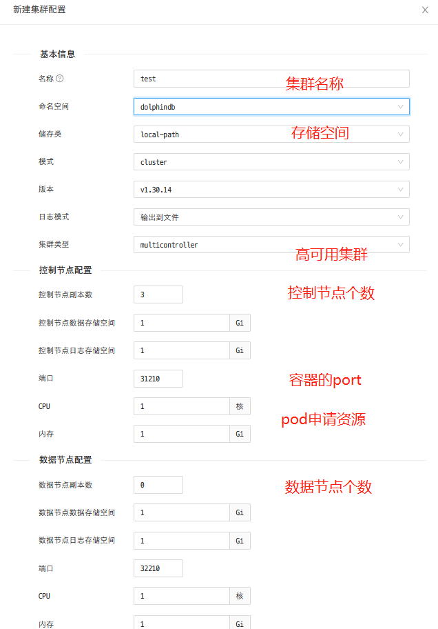
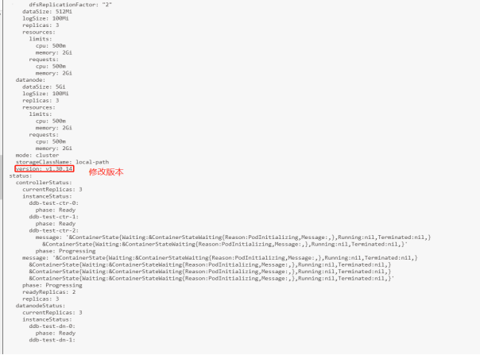

#  基于 K8S 的 DolphinDB 部署教程

Kubernetes（简称 K8S）是一个开源的容器集群管理系统，可以实现容器集群的自动化部署、自动扩缩容、维护等功能。DolphinDB Operator 和 Webserver（简称DolphinDB套件）是部署于 Kubernetes 上的 DolphinDB 集群自动运维系统，提供包括部署、升级、扩缩容、配置变更的 DolphinDB 全生命周期管理。通过 DolphinDB 套件，DolphinDB 可以无缝运行在公有云或私有部署的 Kubernetes 集群上。

- [基于 K8S 的 DolphinDB 部署教程](#基于-k8s-的-dolphindb-部署教程)
  - [1. DolphinDB in Kubernetes 简介](#1-dolphindb-in-kubernetes-简介)
  - [2. 快速部署 DolphinDB](#2-快速部署-dolphindb)
    - [2.1 创建 Kubernetes 集群](#21-创建-kubernetes-集群)
    - [2.2 部署 DolphinDB 套件](#22-部署-dolphindb-套件)
      - [2.2.1 部署 Local Path Provisioner](#221-部署-local-path-provisioner)
      - [2.2.2 安装 DolphinDB 套件](#222-安装-dolphindb-套件)
    - [2.3 部署并连接 DolphinDB 集群](#23-部署并连接-dolphindb-集群)
      - [2.3.1 可视化界面](#231-可视化界面)
      - [2.3.2 部署 DolphinDB 集群](#232-部署-dolphindb-集群)
    - [2.4  升级 DolphinDB 集群](#24--升级-dolphindb-集群)
    - [2.5 销毁DolphinDB 集群](#25-销毁dolphindb-集群)
    - [2.6 卸载 DolphinDB 套件](#26-卸载-dolphindb-套件)
  - [3. K8S 中配置 CoreDump](#3-k8s-中配置-coredump)
  - [4. 常见问题](#4-常见问题)

## 1. DolphinDB in Kubernetes 简介

DolphinDB 在 Kubernetes 环境中以容器的形式运行并提供服务：

- 服务资源：DolphinDB 在 Kubenrnetes 环境中被抽象为自定义资源 ddb，ddb 定义了 DolphinDB 在 Kubernetes 环境中运行的相关属性，通过这些属性指定 DolphinDB 运行的具体配置。

- 资源管理：服务组件 ddb-operator 负责管理 DolphinDB 运行在 Kubernetes 环境中的资源。它将 ddb 资源解析为 Kubernetes 环境中的容器、服务、配置等资源，并实时监听这些资源，保证 DolphinDB 在 Kubernetes 环境中正常运行。

- 身份验证：在 Kubernetes 环境中，DolphinDB 运行前需要通过 license 进行身份验证。license 被定义为一个 ConfigMap 资源。

## 2. 快速部署 DolphinDB

本文的搭建环境以及软件版本信息如下：

服务器：三台阿里云服务器,其外网ip分别为192.168.100.10（master），192.168.100.11（worker），192.168.100.12（worker）

操作系统：Linux（内核3.10以上版本）

内存：8GB

CPU: x86_64（8核心）

docker version：`v20.10.12`，三台均部署

helm version: `v3.7.2`，三台均部署

Kubernetes version：`v1.23.3` ，三台均部署

Kubectl 和 Kubeadm version：`v1.21` 及以上，三台均部署。

DolphinDB 套件 version： [`v1.0.0`](https://hub.docker.com/r/dolphindb/dolphindb-webserver/tags)，正式版本号 ，只需在 master 上部署

DolphinDB 套件是指 Kubernetes 环境中 DolphinDB 的资源和界面管理组件的集合，包含以下部分：

- dolphindb-operator：DolphinDB 在 Kubernetes 环境中的资源管理器；
- dolphindb-webserver：DolphinDB 在 Kubernetes 环境中的可视化管理界面。

本文介绍了如何创建一个 Kubernetes 集群，部署 DolphinDB 套件，并使用它部署一个3节点的高可用集群，最终搭建的集群节点如下:

```shell
controller1  => agent1 => 1 datanode
controller2  => agent2 => 1 datanode
controller3  => agent3 => 1 datanode
```

基本步骤如下：

1. 创建 Kubernetes 集群
2. 部署 DolphinDB 套件
3. 连接 DolphinDB 集群
4. 升级 DolphinDB 集群
5. 销毁 DolphinDB 集群

### 2.1 创建 Kubernetes 集群

创建集群之前，需要先搭建好 docker 以及 helm 环境，参考: [docker 安装教程](https://docs.docker.com/install/)，[Helm安装教程](https://helm.sh/docs/intro/install/)。

docker 安装完成后，在 Linux 命令行窗口执行以下命令，若显示 docker 版本号，则说明安装成功。

```bash
$ docker -v
```

helm安装完成后，在 Linux 命令行窗口执行以下命令，若显示 helm 版本号，则说明安装成功。

```bash
$ helm version
```

推荐两种创建 Kubernetes 集群:

- 单节点 Kubernets 环境部署：使用 [Minikube](https://minikube.sigs.k8s.io/docs/start/)
- 多节点 Kubernets 环境部署：使用 [Kubeadm](https://kubernetes.io/docs/setup/production-environment/tools/kubeadm/install-kubeadm/)

完成 Kubernetes 安装后，在 Linux 命令行窗口执行以下命令，若显示 Kubernetes 版本号，则说明安装成功。

```bash
$ kubectl version
```

### 2.2 部署 DolphinDB 套件

确保满足以下硬件以及软件要求：

硬件条件：详见 [kubeadm](https://kubernetes.io/zh/docs/setup/production-environment/tools/kubeadm/install-kubeadm/) 安装条件。

软件条件：

-  可以使用 kubectl 访问的 Kubernetes 集群（本文以 Kubeadm 为例）
-  已安装 [Helm](https://helm.sh/docs/intro/install/)
-  配置 CoreDump 参考 [3. K8S 中配置 CoreDump](#3-K8S-中配置-coredump)

验证是否安装成功见[2.1 创建 Kubernetes 集群](#21-创建-kubernetes-集群)，本文下面介绍部署步骤：

1. 部署[Local path provisioner](https://github.com/rancher/local-path-provisioner)；

> 注意：
> "Local path provisioner"只是提供了 storageclass ，用于创建 pvc ,如果用户使用其他类型的 sci ,则不需要部署,可以作为没有 sci 的用户的参考项


2. 部署 DolphinDB 套件。

#### 2.2.1 部署 Local Path Provisioner

Local Path Povisioner 可以在 Kubernetes 环境中作为本机路径的 CSI ，使用节点的本机路径来动态分配持久化存储。本节将介绍具体实现方法。

• 从 github 上下载 local-path-provisioner 安装文件：

```shell
$ wget https://raw.githubusercontent.com/rancher/local-path-provisioner/master/deploy/local-path-storage.yaml
```

  期望输出

```bash
--2022-01-12 12:05:27--  https://raw.githubusercontent.com/rancher/local-path-provisioner/master/deploy/local-path-storage.yaml                              
Resolving raw.githubusercontent.com (raw.githubusercontent.com)... 185.199.108.133, 185.199.110.133, 185.199.109.133, ...                
Connecting to raw.githubusercontent.com (raw.githubusercontent.com)|185.199.108.133|:443... connected.          
HTTP request sent, awaiting response... 200 OK                          
Length: 3451 (3.4K) [text/plain]                                         
Saving to: ‘local-path-storage.yaml’                                     
100%[=================================================================================================================================================================================================>] 3,451        402B/s   in 8.6s                                                               
2022-01-12 12:09:35 (402 B/s) - ‘local-path-storage.yaml’ saved [3451/3451]
```

• 修改配置：



该路径目的是持久过存储容器中的数据（详细介绍参考 [local-path-provisioner配置](https://github.com/rancher/local-path-provisioner#configuration) ）

> 注意：
>
> 修改分配 PV 的本机路径：
> 找到名为 "local-path-config" 的 ConfigMap 资源，其 data 字段下的 "config.json" 里包含的属性 "paths" 即为分配的 K8S 集群中的节点路径。如果配置了多个节点路径，将随机选取其中一个作为 PV。

• 在 Kubernetes 环境中部署：

```shell
$ kubectl apply -f  local-path-storage.yaml
```

 期望输出

```shell
namespace/local-path-storage created
serviceaccount/local-path-provisioner-service-account created
clusterrole.rbac.authorization.k8s.io/local-path-provisioner-role created
clusterrolebinding.rbac.authorization.k8s.io/local-path-provisioner-bind created
deployment.apps/local-path-provisioner created
storageclass.storage.k8s.io/local-path created
configmap/local-path-config created
```

#### 2.2.2 安装 DolphinDB 套件

DolphinDB 套件集成在名为 "dolphidb-mgr" 的 chart 包中，存储在 Helm 仓库中。通过 Helm 工具进行部署：

1. 添加 DolphinDB 仓库

```shell
$ helm repo add dolphindb https://dolphindbit.github.io/helm-chart/
```

期望输出：

```
"dolphindb" has been added to your repositories
```

2. 安装 DolphinDB 套件

```shell
$ helm install dolphindb-mgr dolphindb/dolphindb-mgr --set global.version="v1.0.0" --set global.serviceType=NodePort --set global.storageClass=local-path --set dolphindb-webserver.nodePortIP=192.168.100.10 --set-file license.content=$licensePath/license.lic  -ndolphindb --create-namespace
```

DolphinDB 的进程启动需要 license 才能生效，所以需要在指令中增加 `license.content=$licensePath/license.lic` ，并将其改为license 所在的路径。

期望输出：

```shell
NAME: dolphindb-mgr                                                     
LAST DEPLOYED: Wed Jan 12 14:39:11 2022                                 
NAMESPACE: dolphindb
STATUS: deployed
REVISION: 1
TEST SUITE: None
```

主要参数说明如下：

- `-ndolphindb --create-namespace`：将 DolphinDB 套件部署在名为 "dolphindb" 的 namespace 中，如果名为 "dolphindb" 的 namespace 不存在，则创建
- `$licensePath`：DolphinDB License 的存放路径
- `global.serviceType=NodePort, dolphindb-webserver.nodePortIP`：DolphinDB 套件在 Kubernetes 环境中提供的服务类型。ClusterIP：仅在 Kubernetes 环境内部访问；NodePort：通过主机端口可在 Kubernetes 环境内/外部访问；LoadBalancer：通过 Kubernetes 环境中的负载均衡供 Kubernetes 环境内/外部访问。示例选择的是NodePort类型,假设您需要 LoadBalancer 类型，需要修改参数。
- `global.version`: DolphinDB 套件版本号为[`v1.0.0`](https://hub.docker.com/r/dolphindb/dolphindb-operator/tags)。

> 注意：
>
> DolphinDB License 必须是官方授权可用的。若使用无效的 license，会出现诸如 "persistentvolumeclaim log-ddb-t3-crt-0-0 not found" 的报错。

**参数说明**

| **参数**                                   | **说明**                                                     |
| ------------------------------------------ | ------------------------------------------------------------ |
| `global.registry`                          | 用户的镜像仓库，如设置为""，则默认从 dockerhub 拉取镜像。    |
| `global.repository`                        | DolphinDB 的镜像仓库名称，非必要无需修改。                   |
| `global.storageClass`                      | DolphinDB 使用的持久化存储的存储类，不指定则使用默认存储类。 |
| `global.serviceType`                       | DolphinDB 套件在 Kubernetes 环境中提供的服务类型。ClusterIP：仅在 Kubernetes 环境内部访问；NodePort：通过主机端口可在 Kubernetes 环境内/外部访问；LoadBalancer：通过 Kubernetes 环境中的负载均衡供 Kubernetes 环境内/外部访问。 |
| `global.serviceAccount`                    | DolphinDB 套件的 rbac 资源名称，非必要无需修改。             |
| `global.version`                           | DolphinDB 套件版本名称。                                     |
| `global.allNamespace`                      | DolphinDB 是否在所有 namespace 生效。true: DolphinDB 可在部署在所有 namespace 并接受其管理；false: DolphinDB 仅在部署在当前 namespace 并接受其管理。 |
| `dolphindb-operator.replicaCount`          | DolphinDB 套件中 dolphindb-operator 组件的副本数。           |
| `dolphindb-operator.imageTag`              | DolphinDB 套件中 dolphindb-operator 组件的版本号，不指定时与 `global.version` 保持一致。 |
| `dolphindb-webserver.replicaCount`         | DolphinDB 套件中 dolphindb-webserver 组件的副本数。          |
| `dolphindb-webserver.imageTag`             | DolphinDB 套件中 dolphindb-webserver 组件的版本号。不指定时与 `global.version` 保持一致。 |
| `dolphindb-webserver.nodePortIP`           | webserver 展示 DolphinDB 时对外暴露 ip。如果 `global.serviceType` 使用 NodePort 类型，则需要指定 `nodePortIP`。可以指定 Kubernetes 集群中任意一个节点的 ip 为 `nodePortIP`。 |
| `dolphindb.version`                        | DolphinDB 的默认版本号。                                     |
| `dolphindb.serviceType`                    | DolphinDB 在 Kubernetes 环境提供的服务类型，详情可参考 `global.serviceType`。 |
| `dolphindb.controllerDataSize`             | DolphinDB 的每个 Controller 节点的持久化存储数据的默认大小。 |
| `dolphindb.datanodeDataSize`               | DolphinDB 的每个 Datanode 节点的持久化存储数据的默认大小。   |
| `images.default.dolphindb-service-manager` | DolphinDB 初始化镜像的默认版本号。                           |
| `images.default.dolphindb-config-loader`   | DolphinDB 在多 Controller 集群模式下的伴随镜像的默认版本号。 |
| `license.name`                             | DolphinDB License 部署后的 Configmap 资源名称，非必要无需修改。 |
| `license.content`                          | DolphinDB License 的内容。                                   |
| `license.resources`                        | DolphinDB 每个容器的 [cpu 和 memory](https://kubernetes.io/docs/concepts/configuration/manage-resources-containers/) 的默认资源配置。应与 License 中给定的资源配置相同。 |

3. 查看 DolphinDB 套件部署情况

```shell
$ helm list -ndolphindb
```

期望输出：

```shell
NAME          NAMESPACE     REVISION    UPDATED                               STATUS          CHART                   APPVERSION 
dolphindb-mgr DolphinDB     1           2022-01-12 14:39:11.493079194+0800CST deployed        dolphindb-mgr-v1.0.0    1.0.0
```

```shell
$ kubectl get pods -ndolphindb
```

期望输出：

```shell
NAME                                   READY   STATUS    RESTARTS   AGE                                                         
dolphindb-operator-0                   1/1     Running   0          20m                                                         
dolphindb-operator-1                   1/1     Running   0          12m                                                         
dolphindb-webserver-5487785cfd-msr5w   1/1     Running   0          20m                                                         
dolphindb-webserver-5487785cfd-ns5dq   1/1     Running   0          20m
```

> 注意：
>
> Helm 状态变成 deployed 以及 pod 的 STATUS 变成 Running 则表示 DolphinDB 套件部署成功。

### 2.3 部署并连接 DolphinDB 集群

#### 2.3.1 可视化界面

DolphinDB 套件提供的可视化界面默认使用 NodePort 的 ServiceType 进行服务暴露。在完成 DolphinDB 套件部署之后，可在 Kubernetes 环境中查看可视化界面对应的 Service：

```shell
$ kubectl -ndolphindb get svc | grep dolphindb-webserver

#输出结果
dolphindb-webserver   NodePort    10.109.94.68    <none>        8080:30908/TCP   43m
```

通过浏览器访问 DolphinDB 套件的可视化界面：

```
http://$nodeIP:$NodePort/dolphindb-cloud
```

参数说明如下：

- $nodeIP：Kubernetes 环境中任意 node 的 ip。

- $NodePort：终端显示信息中 DolphinDB 套件的可视化界面对应的 NodePort（输出结果中的"30908"）。

> 注意：
>
> 若使用 minikube 部署， 需要执行以下命令:
>
> kubectl port-forward svc/dolphindb-webserver 8080 -ndolphindb

本教程即http://192.168.100.10:30908/dolphindb-cloud/

#### 2.3.2 部署 DolphinDB 集群

1. 点击新建集群


2. 选择新建集群的配置



> 注意：
>
> 1、控制节点与数据节点的 CPU、内存等资源不能超过服务器本身资源，否则集群状态会有异常。
>
> 2、日志模式有两种分别为标准输出和输出到文件，输出到文件性能更佳（推荐）。
>
> 3、控制节点副本数以及数据节点副本数指的集群的控制节点与数据节点的数量。
>
> 4、标准 pvc 更加灵活，local path 更加简便（推荐，部署文档中的 local-path 是存储类，也是用于提供 pvc 的）。
>
> 5、端口指的是 container 的端口，用在 LoadBalancer 中，指定 port 。

3. 成功部署集群


- 状态变成 `Available`，表示集群创建成功，可以正常提供服务。

4. 连接 DolphinDB 集群


如图所示，控制节点的 IP 和 PORT 为 `192.168.100.10:31598`，数据节点的 IP 和 PORT 为 `192.168.100.10:31236`。

> 注意：
>
> 目前 NodePort 服务类型的端口随机分配，不支持指定。

### 2.4  升级 DolphinDB 集群

DolphinDB 组件可简化 DolphinDB 集群的滚动升级。

执行以下命令，手动修改 version 字段为 1.30.15 可将 DolphinDB 集群升级到 1.30.15 版本：

```shell
$ kubectl edit ddb -ndolphindb
```



如下图所示，version 变成 `1.30.15` 以及 status 变成 Available 状态


> 注意：
>
> 通过 web 升级 DolphinDB 的接口正在开发中。

### 2.5 销毁DolphinDB 集群

若需要销毁 Kubernetes 集群，可参考 [2.1 创建 Kubernetes 集群](#21-创建-kubernetes-集群)，具体销毁方法取决于其创建方式。本节仅介绍如何销毁 DolphindDB 集群，具体操作方法如下：

​    方式一：通过 Web 管理器删除按钮销毁


​    方式二：通过命令行进行销毁

```shell
$ kubectl delete ddb $ddbName  -ndolphindb
```

参数说明如下：

- $ddbName：Kubernetes 环境中删除的 DolphinDB 集群名称。

### 2.6 卸载 DolphinDB 套件

通过以下命令可卸载 DolphinDB 套件

```bash
$ helm uninstall dolphindb-mgr-ndolphindb
```

## 3. K8S 中配置 CoreDump

当 DolphinDB 发生 core dump 时，系统会终止当前进程并生成 core dump 文件。在 Kubernetes 环境中，需要在 DolphinDB 容器运行的宿主机上执行以下命令来启用 core dump，如需了解更多 core dump 信息，参阅[DolphinDB Crash](https://gitee.com/dolphindb/Tutorials_CN/blob/master/how_to_handle_crash.md)中第三节。

```
echo "/data/ddb/core/core.%p"  | sudo tee /proc/sys/kernel/core_pattern
```

其中 "`/data/ddb/core`" 为 core dump 文件在容器中的路径，若与当前宿主机的配置有冲突，可在部署 DolphinDB 套件时通过参数 `dolphindb.coreDumpDir` 自定义。

## 4. 常见问题

* 创建集群后，如果 Pod 没有创建，则可以通过以下方式进行诊断：

```
kubectl get pod -nlphindb
kubectl describe pod $podName -ndolphindb
kubectl get statefulsets -n dolphindb
kubectl describe statefulsets -n dolphindb
```

* Pod 处于 Pending 状态，通常都是资源不满足导致的，比如：

  1、使用持久化存储的Pod 使用的 PVC 的 StorageClass 不存在或 PV 不足

  2、Kubernetes 集群中没有节点能满足 Pod 申请的 CPU 或内存

  此时，可以通过 kubectl describe pod 命令查看 Pending 的具体原因：

```
kubectl describe po -n ${namespace} ${pod_name}
```

